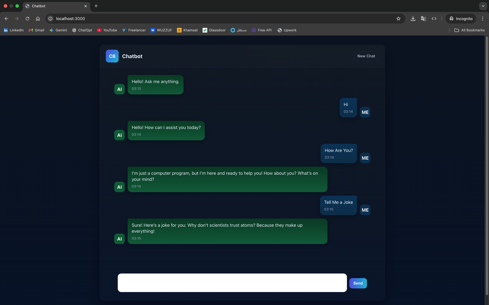
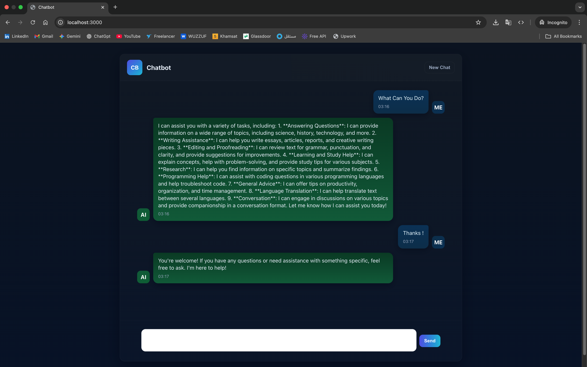

# Chatbot Demo
<div align="center">
  
  <div>
  
  </div>
</div>


This workspace contains a simple responsive chat UI (`/site`) and a minimal Node.js proxy (`/server`) that forwards requests to the OpenAI Chat Completions API.

Quick start

1. Copy `.env.example` to `.env` and set `OPENAI_API_KEY`.
2. Start the server:

```bash
cd server
npm install
npm start
```

3. Open http://localhost:3000/ in your browser.

Notes
- Do not expose your OpenAI API key in client-side code. Use the provided proxy or your own backend.
- The frontend submits the conversation as an array of messages compatible with the Chat Completions API.
- This application enforces a single fixed model on the server and frontend: `gpt-4o-mini`. The UI does not allow selecting any other model.
